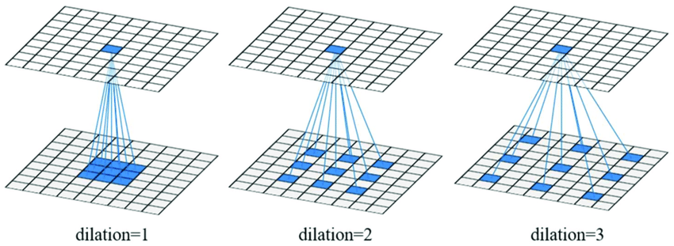

# WaveNet: A Generative Model for Raw Audio

- **WaveNet**: DeepMind에서 개발한 음성을 생성하는 모델로, TTS, 음악, 음성 개선, 음성 변환, 음원 분리 등에 활용될 수 있다.

# 1. Joint Probability of a waveform $\mathbf{x}$

- 아날로그 음성을 **디지털 음성**으로 변환할 수 있다. 이때 그 음성을 $\mathbf{x} = \{ x_{1}, \cdots, x_{T} \}$으로 나타낼 수 있고, 각각의 $x_{i}$는 음성의 진폭(amplitude)을 의미한다.

사진 출처: https://www.electronicshub.org/modulation-and-different-types-of-modulation/

- $\mathbf{x} = \{ x_{1}, \cdots, x_{T} \}$ 음성이 발생할 확률을 **곱셈 정리**에 의해 다음과 같이 쓸 수 있다.
$$ p(\mathbf{x}) = \prod_{t=1}^{T} p(x_{t}|x_{1}, \cdots, x_{t-1})$$

    - 이는 언어 모델에서 어떤 문장이 발생(성립)할 확률과 같은 원리이다. (밑바닥 2권 p.194)
    
- **stack of convolutional layers**를 이용하여 $p(x_{t}|x_{1}, \cdots, x_{t-1})$를 구할 수 있다.
- **log-likelihood**를 이용하여 쉽게 음성이 발생할 확률(joint probability, 결합확률)을 높이는 방향으로 학습할 수 있다.
    - **likelihood function**: 위의 상황에서 likelihood function은 음성이 발생할 확률과 같다. $L(\theta)$는 $\theta$라는 파라미터를 가질 때 확률분포를 의미한다.
$$ L(\theta) = p(\mathbf{x}|\theta) = \prod_{t=1}^{T} p(x_{t}|x_{1}, \cdots, x_{t-1}, \theta)$$
    
    - **log-likelihood function**: 그러나 위의 식은 곱으로 이루어져 있으므로 미분이 쉽지 않다.
    따라서 여기에 로그를 취해줌으로써 미분을 적용하기 쉽도록 만들어준다. 또한 앞에 (-) 부호를 붙인다.
$$ E(\theta) = -\ln L(\theta) = -\sum_{t=1}^{T} \ln p(x_{t}|x_{1}, \cdots, x_{t-1}, \theta)$$
    
        - 이를 최소화하는 것이 음성의 발생 확률을 높이는 방법이다.
        - 따라서 이 함수를 **손실 함수**로 설정하면 제대로 학습할 수 있다.

# 2. Dilated Casual Convolutions

- **Casual**: 시계열 데이터를 처리할 때, 모델이 현재 시점 이전의 데이터만을 참고하여 예측을 수행하는 것을 의미한다.
    - 위의 경우 음성 데이터 $x_{t}$는 오로지 $x_{i}(i<t)$로부터 영향을 받는다고 가정한다.

- **Casual Convolutional Layers**

    - 이 모델은 Recurrent connections(순환 연결)이 없기 때문에 RNN보다 빠르게 학습할 수 있다.
    - 그러나 위 그림에서 **Receptive field**가 5이므로 output이 input을 충분히 반영하지 못한다.
    $$ \textrm{(Receptive field)} = \textrm{(#Layers)} \times \textrm{(filter length - 1)} + 1 $$
        - Receptive field를 늘리려면 layer를 증가시키거나 filter length를 증가시켜야 한다.
    - **Receptive field(수용 영역)**: CNN에서 output의 특정 뉴런이 input 데이터 상에서 수용하는 영역

- **Dilated Convolution**: 합성곱 연산에서 필터의 간격을 넓히는 방법

사진 출처: Multiscale Spatial-Spectral Convolutional Network with Image-Based Framework for Hyperspectral Imagery Classification - Scientific Figure on ResearchGate. Available from: https://www.researchgate.net/figure/An-illustration-of-the-receptive-field-for-one-dilated-convolution-with-different_fig1_336002670 [accessed 4 May, 2023]

- **Dilated Casual Convolution Layers**: Dilated Convolution + Casual Convolution Layers

    - 이 방법은 Casual Convolution Layers보다 훨씬 많은 **Receptive field**를 갖게 된다. (지수 증가)
    $$ \textrm{(Receptive field)} = 2^\textrm{#Layers}$$
    
    - 이 논문에서는 dilation이 $1, 2, 4, \cdots, 512$가 되도록 세 번 반복하여 설계했다. 이때 Receptive Field는 1024가 된다.

# 3. Softmax Distributions

- 오디오 샘플의 조건부 확률 분포 $p(x_{t}|x_{1}, \cdots, x_{t-1})$를 구하는 데에는 다양한 모델(mixture model)들이 이용되어 왔다.
- 그러나 한 논문에 따르면 **Softmax Distribution**도 오디오 샘플에서 좋은 결과를 냈다고 한다. 이 논문에서는 Softmax를 이용한다.

- 흔히 Raw audio에서는 16-bit integer를 이용하므로, 가질 수 있는 값이 총 65,536개이다.
- 이는 Softmax Layer를 적용하기에는 적합하지 않다.
- 따라서 **$\mu$-law companding transformation** 을 이용해서 가능한 값을 256개(8-bit)로 줄인다. (**Quantization(양자화)**)

- **$\mu$-law companding transformation**: 로그함수에 기반한 비선형 변환 방법 중 하나로, 주로 음성 신호 처리 분야에서 사용하는 변환
$$ f(x_{t}) = \textrm{sign}(x_{t})\frac{\ln(1+\mu|x_{t}|)}{\ln(1+\mu)}$$

    사진 출처: https://commons.wikimedia.org/wiki/File:Mu-law_function.svg#/media/File:Mu-law_function.svg

    - 진폭이 작은 소리의 변화에는 더 민감하게 설정
    - 이렇게 재구성한 신호는 (선형 함수에 의해 재구성된 신호보다) 실제 음성과 매우 유사하게 들린다.

# 4. Gated Activation Units

- **Gated Activation Units**: 딥러닝 모델에서 사용되는 활성화 함수 중 하나로, Sigmoid, Tanh 등의 활성화 함수와 함께 사용된다.
    - 이 논문에서 사용할 GAU는 다음과 같다.
    $$ \mathbf{z} = \tanh(W_{f, k}*\mathbf{x}) \odot \sigma(W_{g, k}*\mathbf{x})$$
    ($*$: convolution operator, $\odot$: element-wise multiplication operator, $k$: layer index, $f$: filter, $g$: gate)
    
    - $\tanh$ 함수는 정보의 중요도를 의미하고, $\sigma$ 함수는 게이트 역할을 한다고 볼 수 있다. (밑바닥 2권 p.252
   )
    - 이 활성화 함수는 오디오 신호에서 ReLU보다 상당히 좋은 성능을 보인다는 것이 밝혀진 바 있다.

# 5. Residual and Skip-Connections

- **Residual Block**

    - Residual Block은 **Dilated Conv** > **Gated Activation Units** > **1x1 Conv** 순서로 지나고, **Residual**이 추가되어 더욱 강력한 모델을 만든다.
    - **Residual**, **Skip Connections**: 층을 건너뛰어 출력과 더함으로써 구현된다. 이 과정은 **수렴 속도를 빨라지게** 한다. 또한 **기울기 소실 문제를 해결**한다.
    
    - Layer는 30개이다.

- Entire Architecture

    사진 출처: https://www.youtube.com/watch?v=nsrSrYtKkT8&t=1580s
    
    - input: $256 \times T$ (**One-hot Encoding일 것으로 예측됨.**)
    
    - **1x1 Conv의 역할**
        1. filter 개수 조절로 매개변수 크기를 조절
        2. Fully Connected Layer를 대체하는 역할을 한다.

# 6. Conditional WaveNets

- **Conditional WaveNet**: WaveNet에 **Condition(화자의 정보, 음성의 텍스트 정보 등)**을 추가로 입력하여 학습시키는 것
- 조건 $\mathbf{h}$ 하의 음성 성립 확률 $ p(\mathbf{x}) = \prod_{t=1}^{T} p(x_{t}|x_{1}, \cdots, x_{t-1})$은 다음과 같다.
$$ p(\mathbf{x}|\mathbf{h}) = \prod_{t=1}^{T} p(x_{t}|x_{1}, \cdots, x_{t-1}, \mathbf{h})$$

## 6.1. Global Conditioning

- **Global Conditioning**: 모든 시간 단계에서 출력 분포에 영향을 미치는 **하나의 잠재적인 조건**(예: 화자의 정보)으로 특정되는 것
    - 이때의 활성화 함수는 다음과 같다.
    $$ \mathbf{z} = \tanh(W_{f, k}*\mathbf{x}+V_{f, k}^{T} \mathbf{h}) \odot \sigma(W_{g, k}*\mathbf{x}+V_{g, k}^{T} \mathbf{h})$$
    ($*$: convolution operator, $\odot$: element-wise multiplication operator, $k$: layer index, $f$: filter, $g$: gate,  
    $V_{*, k}$: learnable **linear projection**, $V_{*, k}^T \mathbf{h}$: $N$x1에서 $N$x$T$($T$: 시계열 길이)로 **broadcast**됨. $N$은 512로 추측됨.)

## 6.2. Local Conditioning

- **Transposed Convolution**: Convolution과 반대로 연산함으로써 **Upsampling**하는 방법

사진 출처: https://arxiv.org/pdf/1603.07285.pdf

- **Local Conditioning**: 오디오 신호보다 <u>낮은 샘플링 주파수</u>를 가진 시계열 조건 $\mathbf{h}=\{h_t\}$(예: TTS에서의 텍스트 Embedding)에 영향을 받는 것
    - 먼저 $\mathbf{h}$를 **Transposed Convolutional Network**로 **Upsampling**한다. 변환된 시계열 데이터를 $\mathbf{y}=f(\mathbf{h})$라 하자.
    - 이때의 활성화 함수는 다음과 같다.
    $$ \mathbf{z} = \tanh(W_{f, k}*\mathbf{x}+V_{f, k} * \mathbf{y}) \odot \sigma(W_{g, k}*\mathbf{x}+V_{g, k} * \mathbf{y})$$
    ($V_{*, k}*\mathbf{y}$: **1x1 convolution**)

- Transposed convolutional network 대신 $V_{*, k}*\mathbf{h}$를 이용하고 시계열에 맞게 반복하는 방법도 있으나, 결과가 다소 나빠진다.

# 7. Context Stacks

- Receptive field size를 늘리는 방법
    1. Using more layers
    2. Using larger filters
    3. Using greater dilation factors
    4. **Context Stacks**: 큰 WaveNet 아래에 더 작은 부분의 오디오 신호만 처리하는 별도의 작은 네트워크
    - Context Stacks를 이용하면 적은 레이어만을 이용할 수 있고, 합리적인 수준의 계산을 할 수 있고, 적은 용량을 사용하게 된다.
    

# Additional Resources

1. WaveNet 논문 리뷰 블로그: https://joungheekim.github.io/2020/09/17/paper-review/
2. WaveNet 논문 리뷰 유튜브: https://www.youtube.com/watch?v=GyQnex_DK2k&t=746s
3. Input이 원-핫 인코딩으로 되어있는지에 대한 질문글: https://stats.stackexchange.com/questions/471852/mismatching-dimensions-of-input-output-in-the-wavenet-model-for-text-to-speech-g
4. 1x1 Conv와 casual conv 등의 input과 output에 관한 발표 자료: https://slideplayer.com/slide/13025889/
5. WaveNet 코드 구현: https://seujung.github.io/2018/06/03/wavenet/
